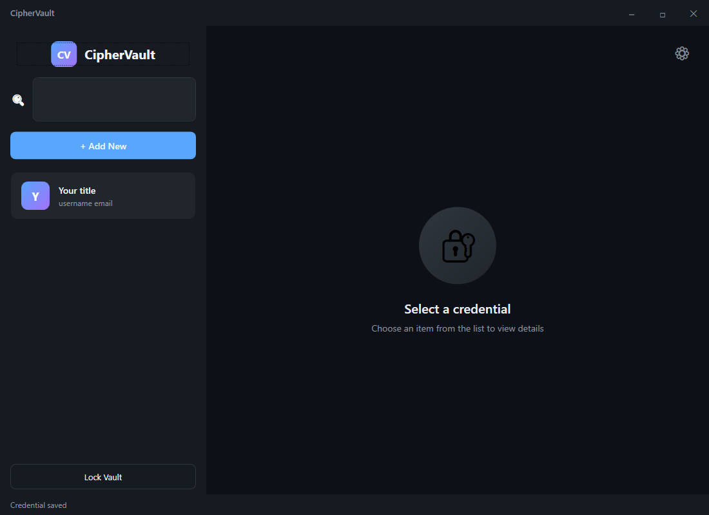
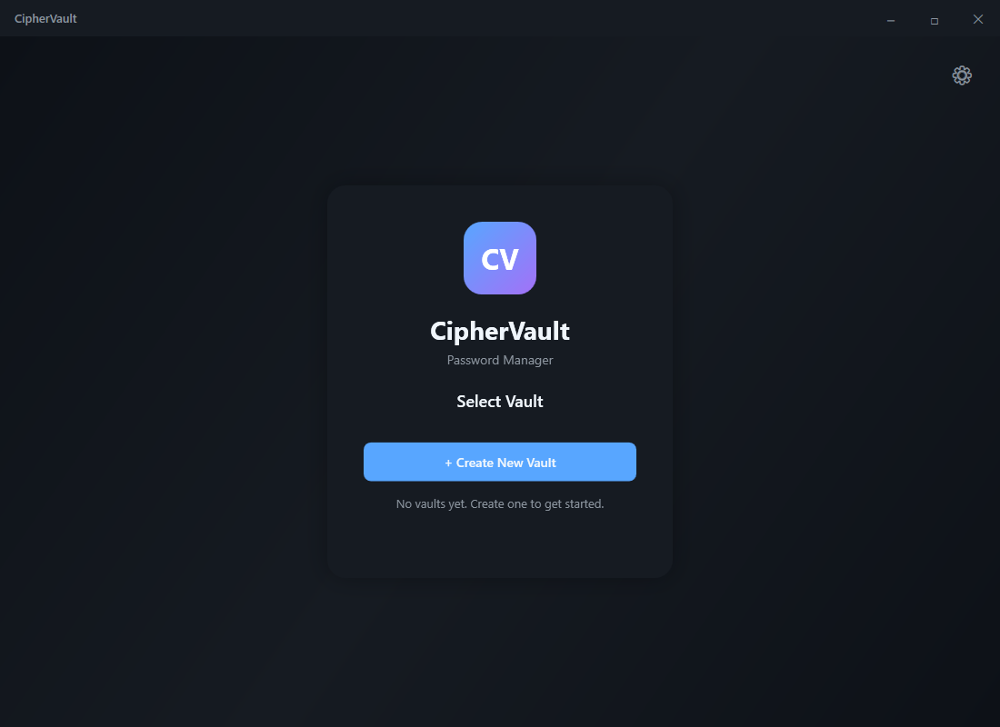
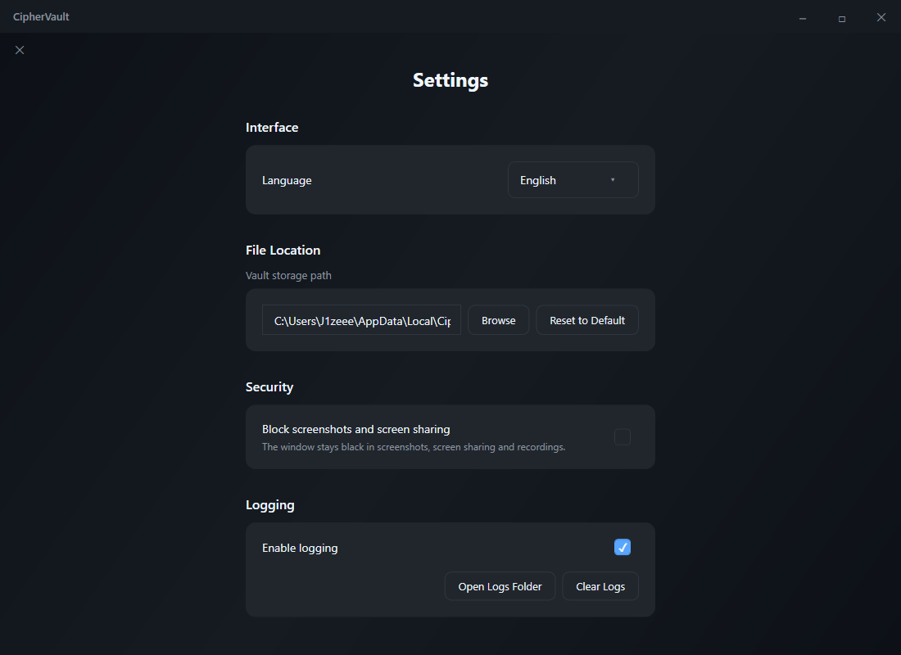

# CipherVault

**Secure, offline password manager for Windows with modern cryptography.**

[](https://dotnet.microsoft.com/download)
[](https://learn.microsoft.com/dotnet/csharp)
[](LICENSE)
[](https://www.microsoft.com/windows)
[](https://github.com/Anomalyous/CipherVaultV2/releases/latest)
[](docs/README-RU.md)

<br>



*Main vault screen with credential list and details panel.*

<br>

## Features

- **AES-256-GCM** authenticated encryption for all vault data
- **Argon2id** key derivation (128 MB memory, 3 iterations, 4 threads)
- **HKDF-SHA256** key separation — distinct keys for verification and encryption
- **Secure in-memory buffers** — `VirtualAlloc` + `VirtualLock` + `CryptProtectMemory`, zeroed on dispose
- **Anti-screen-capture** via `SetWindowDisplayAffinity`
- **Auto-lock** after 1 minute of inactivity
- **Brute-force protection** — exponential backoff (up to ~34 min delay)
- **Clipboard auto-clear** 10 seconds after copy
- **Cryptographic password generator** with strength analysis
- **Audit logging** (optional, disabled by default)
- **Multi-vault** support
- **Multi-language** UI (English / Russian)
- **Dark theme** with custom WPF controls
- **Import / Export** as ZIP
- **Self-contained single-file** publish — no runtime required

<br>

## Security & Threat Model

| Protected against | Notes |
|---|---|
| **Master password brute-force** | Argon2id (128 MB, 3 iter) + exponential backoff after 5 failures |
| **Memory dump extraction** | VirtualLock prevents paging to disk; CryptProtectMemory encrypts data in RAM; buffers are zeroed on release |
| **Ciphertext tampering** | AES-GCM authentication tag rejects modified vaults |
| **Screen capture** | `WDA_EXCLUDEFROMCAPTURE` on the main window |
| **Timing attacks** | `CryptographicOperations.FixedTimeEquals` for password verification |

| Not covered | Reason |
|---|---|
| **Keylogger / formgrabbing** | The OS is assumed trusted; no magic bullet for user-side malware |
| **Compromised OS** | If the attacker controls the system, all in-process protection is bypassable |
| **Physical access with memory freezer** | Cold boot attacks are out of scope for a desktop app |

### Argon2id parameters

| Parameter | Value |
|---|---|
| Algorithm | Argon2id |
| Memory | 128 MB |
| Iterations | 3 |
| Parallelism | 4 threads |
| Salt | 32 bytes (random per vault) |
| Output | 32 bytes (master key) |

<br>

## Tech Stack

```
.NET 8.0  •  WPF  •  C# 14
```

| Library / API | Purpose |
|---|---|
| `System.Security.Cryptography` | AES-256-GCM, HKDF, RNG, constant-time ops |
| `Konscious.Security.Cryptography.Argon2` | Argon2id KDF |
| `kernel32.dll` (P/Invoke) | VirtualAlloc, VirtualLock |
| `crypt32.dll` (P/Invoke) | CryptProtectMemory |
| `System.Text.Json` | Config & vault serialization |
| `System.IO.Compression` | Vault import/export |

<br>

## Getting Started

### Requirements

- Windows 10+ (x64)
- .NET 8 Runtime *(not needed if using the self-contained build)*

### Build from source

```powershell
git clone https://github.com/Anomalyous/CipherVaultV2.git
cd CipherVaultV2
dotnet publish -c Release -r win-x64 --self-contained true
.\bin\Release\net8.0-windows10.0.26100.0\win-x64\publish\CipherVault.exe
```

### Download release

Download the latest `CipherVault-v1.0.0-win-x64.zip` from [Releases](https://github.com/Anomalyous/CipherVaultV2/releases/latest), extract and run `CipherVault.exe`.

<br>

## Usage

**1. Create a vault** — set a master password (Argon2id derives the encryption key).



**2. Add credentials** — title, username, email, password, website, notes. Generate strong passwords with the built-in generator.


**3. Lock & unlock** — the vault locks after 1 min of inactivity. The master key is held in protected memory (SecureSession) and cleared on lock.



<br>

## Architecture

```
Master password  +  Random salt
          │
          ▼
      Argon2id  (128 MB / 3 iter / 4 threads)
          │
          ▼
     Master key  (32 bytes)
          │
          ├── HKDF — info="verify"   ──▶  Verification key  (stored in config.json)
          │
          └── HKDF — info="encrypt"  ──▶  Encryption key   (held in SecureBuffer, never persisted)
                                               │
                                               ▼
                                        AES-256-GCM Encrypt / Decrypt
                                               │
                                               ▼
                                       vault.dat  (nonce + ciphertext + tag)
```

- **`vault.dat`** contains the encrypted credential payload. Each encryption generates a fresh 12-byte random nonce.
- **`config.json`** stores the verification hash, Argon2id salt, and vault metadata — never the encryption key.
- The encryption key exists only in process memory inside a `SecureBuffer` (VirtualAlloc + CryptProtectMemory).

<br>

## Roadmap

- [ ] Have I Been Pwned integration (k-anonymity API)
- [ ] Browser auto-fill extension
- [ ] Password health dashboard (weak / reused / expired)
- [ ] TOTP authenticator
- [ ] Encrypted export with password
- [ ] macOS / Linux support (Avalonia / MAUI)

<br>

## Contributing

PRs are welcome. For major changes, open an issue first to discuss.

<br>

## License

[Apache 2.0](LICENSE)
