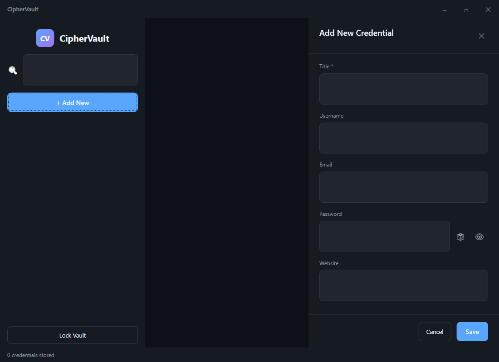
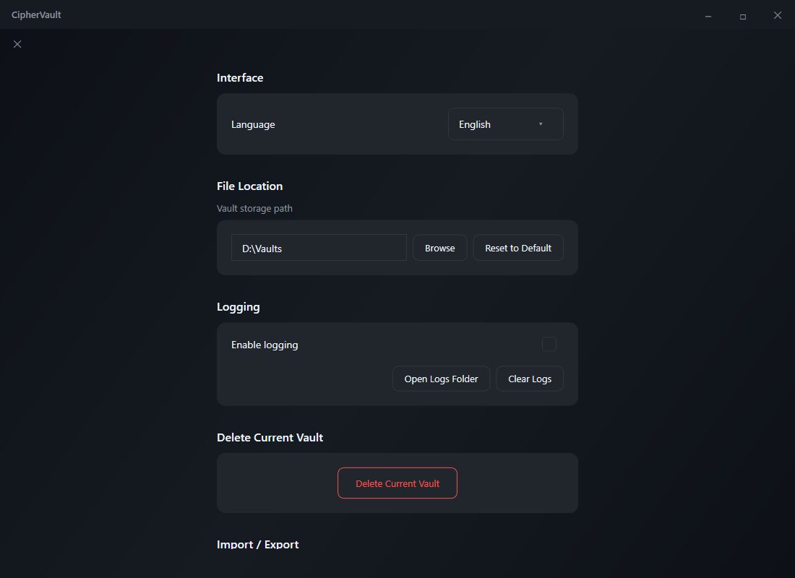

# 🔐 CipherVault

<div align="center">


**Secure, offline password manager built with WPF and modern cryptography**

</div>

---

## 📖 About

CipherVault is a secure, offline password manager for Windows that helps you store and manage your credentials safely. Built with .NET 8 and WPF, it uses industry-standard encryption (Argon2id + AES-GCM) to protect your data.

### ✨ Features

- 🔒 **Military-grade encryption** — Argon2id key derivation + AES-GCM encryption
- 🛡️ **Secure memory handling** — Passwords stored in protected memory buffers
- 🎲 **Password generator** — Create strong, customizable passwords
- 🌍 **Multi-language support** — English and Russian localization
- 📝 **Audit logging** — Track all security-related events
- ⏱️ **Auto-lock** — Automatic vault locking after inactivity
- 📋 **Clipboard management** — Secure clipboard with auto-clear
- 🎨 **Modern UI** — Clean, intuitive WPF interface with dark theme

---

## 🚀 Quick Start

### Prerequisites

- [.NET 8.0 SDK](https://dotnet.microsoft.com/download/dotnet/8.0) or later
- Windows 10/11 (x64)
- Visual Studio 2022 (recommended) or VS Code

### Installation

1. **Clone the repository**
   ```bash
   git clone https://github.com/yourusername/CipherVault.git
   cd CipherVault
   ```

2. **Build the project**
   ```bash
   dotnet restore
   dotnet build --configuration Release
   ```

3. **Run the application**
   ```bash
   dotnet run --project CipherVault.csproj
   ```

### Publishing (Single File Executable)

Create a standalone executable:

```bash
dotnet publish -c Release -r win-x64 --self-contained true -p:PublishSingleFile=true
```

The executable will be located in `bin/Release/net8.0-windows10.0.26100.0/win-x64/publish/`

---

## 🏗️ Architecture

CipherVault follows the **MVVM (Model-View-ViewModel)** pattern for clean separation of concerns.

```
CipherVault/
├── Models/             # Data models (Credential, etc.)
├── ViewModels/         # ViewModels (MainViewModel, etc.)
├── Views/              # XAML views (MainWindow.xaml, etc.)
├── Services/           # Business logic services
│   ├── StorageService.cs      # Vault storage & encryption
│   ├── PasswordGenerator.cs   # Secure password generation
│   ├── AuditService.cs        # Security event logging
│   ├── LocalizationService.cs # Multi-language support
│   ├── SecureMemoryService.cs # Protected memory management
│   └── VaultManagerService.cs # Vault lifecycle management
├── SecureControls/     # Custom secure input controls
├── Converters/         # XAML value converters
└── Resources/          # Application resources & icons
```

---

## 🔧 Technologies Used

| Technology | Purpose |
|------------|---------|
| **.NET 8.0** | Runtime framework |
| **WPF** | User interface |
| **Argon2id** | Key derivation (via Konscious.Security.Cryptography) |
| **AES-GCM** | Symmetric encryption |
| **System.Text.Json** | Data serialization |
| **SecureString / Custom Buffers** | Secure memory handling |

---

## 🔒 Security Features

### Encryption
- **Key Derivation**: Argon2id with configurable parameters
  - Memory: 128 MB
  - Iterations: 3
  - Parallelism: 4 threads
- **Encryption**: AES-256-GCM with random nonce
- **Key Size**: 256 bits

### Memory Protection
- Credentials stored in `SecureBuffer` wrappers
- Sensitive data cleared from memory on disposal
- Minimized plaintext exposure time

### Vault Protection
- Brute-force protection with exponential backoff
- Account lockout after 5 failed attempts
- Automatic vault locking on inactivity

### Audit Trail
All security events are logged:
- Vault creation/opening/closing
- Login attempts (success/failure)
- Credential modifications
- Password generation
- Security warnings

---

## 📸 Screenshots

> 
> 
>
> 
>
> 
>
> 
>

---

## 🌐 Localization

CipherVault supports multiple languages. Currently available:

- 🇬🇧 English (default)
- 🇷🇺 Russian

To add a new language, extend the `LocalizationService` with additional translations.

---

## 📦 Dependencies

```xml
<PackageReference Include="System.Text.Json" Version="8.0.5" />
<PackageReference Include="Konscious.Security.Cryptography.Argon2" Version="1.3.0" />
<PackageReference Include="System.IO.Compression.ZipFile" Version="4.3.0" />
```

---

## 🤝 Contributing

Contributions are welcome! Please follow these steps:

1. Fork the repository
2. Create a feature branch (`git checkout -b feature/amazing-feature`)
3. Commit your changes (`git commit -m 'Add amazing feature'`)
4. Push to the branch (`git push origin feature/amazing-feature`)
5. Open a Pull Request

### Development Guidelines
- Follow existing code style
- Add tests for new features
- Update documentation as needed
- Ensure no sensitive data is committed

---

## 📄 License

This project is licensed under the **Apache License 2.0** - see the [LICENSE](LICENSE) file for details.

---

## ⚠️ Disclaimer

CipherVault is provided "as is" without warranty of any kind. While best practices are implemented for security, users should:
- Always backup their vault data
- Use strong master passwords
- Keep their systems updated
- Understand that no software is 100% secure

---

## 📞 Support

For issues, questions, or suggestions:
- 🐛 Open an issue on GitHub
- 📧 Contact the maintainers

---

<div align="center">

**Made with ❤️ using .NET**

⭐ Star this repo if you find it useful!

</div>
